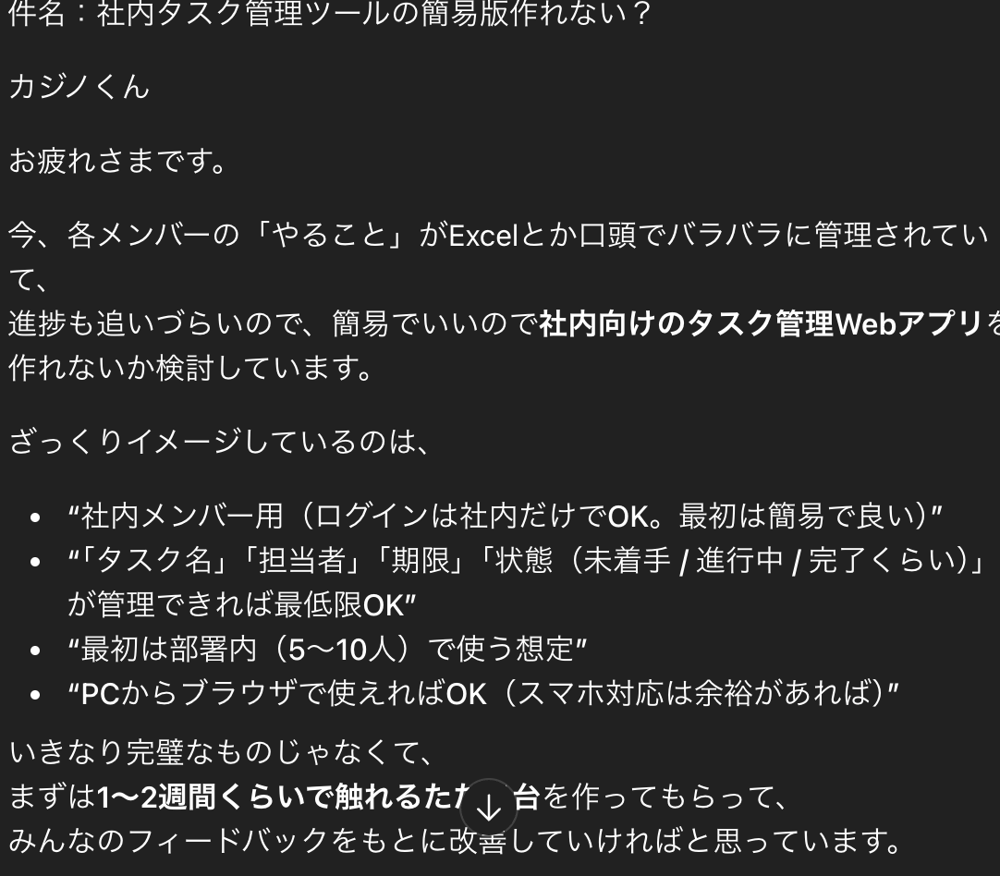

# TaskManager　— タスク管理ミニアプリ

## はじめに
TaskManager は、社内メンバー向けのシンプルなタスク管理アプリです。
タスクの登録・編集・一覧表示ができ、担当者(メンバー)と紐付けて管理できます。

Spring Boot + Thymeleaf + H2 Database の構成で動作する学習用 Web アプリです。

チャットGPTに上司としてタスクを投げてもらい作成しました。



---

## 機能


### タスク管理
- タスク一覧表示
- タスク新規登録
- タスク編集
- 作業時間（h）の管理
- ステータス（未着手 / 進行中 / 完了）の管理
- 担当者（Member）との紐付け

### メンバー管理
- メンバー一覧
- メンバーの新規登録
- メンバー編集
- メンバー削除

---

## 技術スタック

- **Spring Boot 3.5.7**
- **Thymeleaf**
- **H2 Database**
- **Spring Data JPA / Hibernate**
- **Maven**
- **Java17**

---

### セットアップ
#### 1 Clone

```bash

git clone https://github.com/yourname/TaskManager.git
cd TaskManager
```


#### 2 Run

``` bash

./mvnw spring-boot:run
```

#### 3 Access

``` bash

http://localhost:8080/tasks
```
---

## 学習したこと

- Spring MVC（Controller / Form / View）の一連の流れ
- CRUD 実装の基礎
- Bean Validation による入力チェック
- 多対一リレーション（Task → Member）
- H2 データ初期化（schema.sql / data.sql）
- Thymeleaf のフォームバインディング理解

---

## 今後の拡張予定

- ログイン・認可機能（Spring Security）
- タスク検索（担当者 / ステータス）
- 作業時間レポート
- API 化（React フロント版）
- デプロイ（Render / Railway / AWS）

## 作者
**梶野　悠久**


